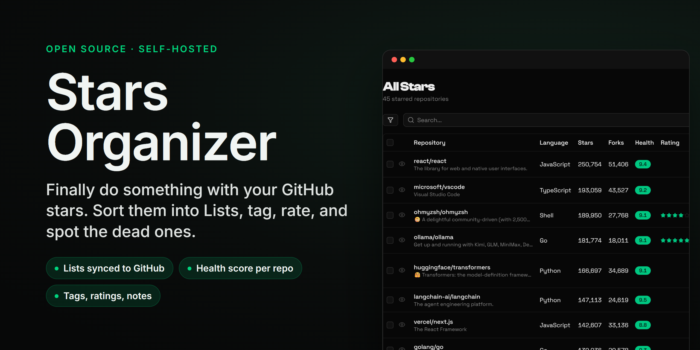
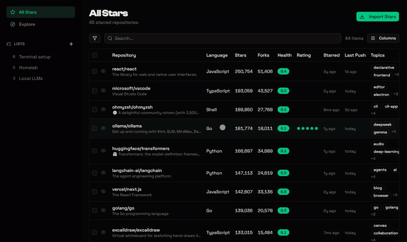
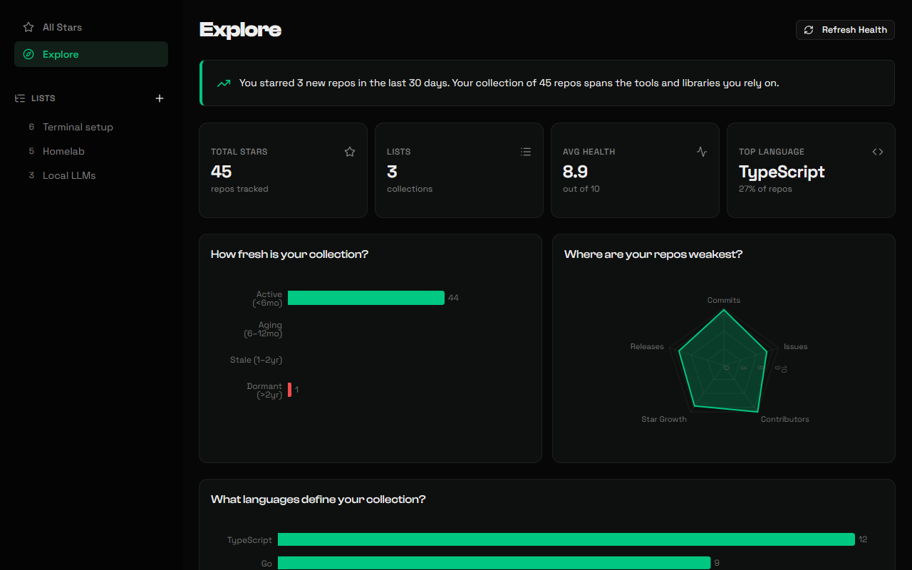

<p align="center">
  
</p>

**Hundreds of GitHub stars and no way to find anything?** Stars Organizer pulls every repo
you've starred into one fast table you can search, tag, rate and annotate, sorts them into
GitHub Lists that sync back to your profile, and scores each repo's health so the abandoned
ones stand out.

<p align="center">
  
</p>

- **Lists that sync to GitHub.** New Lists, deleted Lists and repos you add to a List are
  written back to your GitHub Lists.
- **A health score for every repo** from commit recency, issue resolution, contributors,
  star growth and release cadence, so you can tell a living project from a dead one.
- **Your own layer on top:** tags, a 1–5 usefulness rating and free-form notes, stored locally.
- **Explore your collection:** how fresh it is, where your repos are weakest, which languages
  dominate, and when you found them.
- **Unstar** in one click, synced to GitHub.
- **Agent-friendly.** An AI agent can read everything over a read-only SQL role and act
  through the same API as the UI, so "put every archived repo in a *Graveyard* list" is one
  request.

<p align="center">
  
</p>

---

## Why This Exists

I have hundreds of starred repos and no good way to organize them. GitHub's native Lists are barely discoverable and there is no tagging, rating, or bulk curation. I wanted a local surface over my stars that an agent could read and help me tidy: sort into Lists, tag by purpose, rate usefulness, and push the results back to GitHub so the organization survives outside this tool.

---

## Development

### Prerequisites

- Docker (Postgres + ElectricSQL)
- Node.js 20+
- A GitHub personal access token with `repo` and `read:user` scopes

### Quick Start

```bash
cp .env.example .env
cp server/.env.example server/.env
# edit server/.env and set GITHUB_TOKEN to a real PAT

docker compose up -d          # Postgres (:5433) + ElectricSQL (:3000)

cd server && npm install && npm run dev   # Hono API on :4000
npm install && npm run dev                # Vite frontend on :5173
```

Apply the schema once Postgres is up:

```bash
PGPASSWORD=password psql -h localhost -p 5433 -U postgres -d app -f schema.sql
```

Then open http://localhost:5173 and import your stars.

### Commands

```bash
npm run lint          # eslint
npm run build         # tsc -b && vite build
```

---

## Architecture

```
github-stars-organizer/
├── src/
│   ├── routes/            # index (main table), explore (dashboard), list.$listId
│   ├── components/        # table, views (dashboard/kanban/list), detail sheet, ui
│   ├── db/                # PGlite + Electric provider
│   └── lib/
│       ├── collections.ts # TanStack DB collections, one per table
│       └── api.ts         # browser -> API fetch wrapper
├── server/
│   └── index.ts           # Hono API: GitHub sync + business logic + Electric proxy
├── schema.sql             # Postgres schema
└── docker-compose.yml     # Postgres + ElectricSQL
```

**Reads and writes are separated.** An agent reads the database directly over a read-only SQL connection. All writes go through the Hono API so the GitHub sync and validation run; nothing writes to Postgres as a superuser.

**Electric drives the UI.** ElectricSQL streams Postgres shapes into the browser through an API proxy. TanStack DB turns each table (`repos`, `lists`, `list_items`, `tags`, `repo_tags`) into a live collection, and the React UI re-renders on change.

**The schema is the source of truth.** Tables use UUID primary keys and are defined in `schema.sql`; drizzle-orm config is available for schema tooling.

---

## Tech Stack

| Layer      | Technology                                             |
|------------|--------------------------------------------------------|
| UI         | React 19, TypeScript, Vite, Tailwind v4, shadcn        |
| State      | TanStack DB, TanStack Router, TanStack Table           |
| Sync       | ElectricSQL (@electric-sql/client, pglite)             |
| API        | Hono                                                    |
| Data       | Postgres 16, drizzle-orm                                |
| GitHub     | @octokit/rest, GitHub GraphQL API                      |

---

## License

Released under the GNU Affero General Public License v3.0 — see [LICENSE](LICENSE). If you run a modified version where other people can reach it, the AGPL asks you to publish your changes too.
